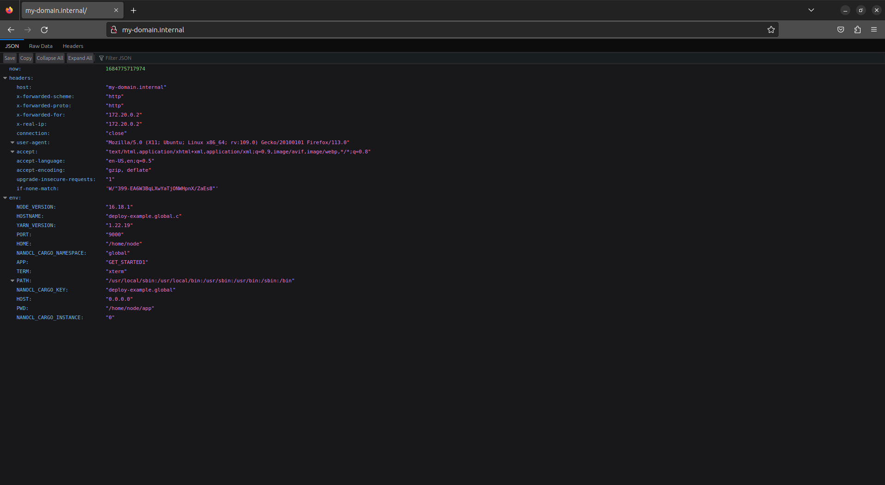

# Your own VPN

Nanocl aim to make your life easier so we have a prebuilt VPN Statefile.<br />
Based on [hwdsl2/docker-ipsec-vpn-server](https://github.com/hwdsl2/docker-ipsec-vpn-server) from [@Lin Song](https://github.com/hwdsl2) you can use it from our [Official Nanocl Repository](https://nhnr.io)

```sh
nanocl state apply -s nhnr.io/sys/vpn.yml
```

If you want to tweak it more than what is already possible from the `Statefile Args`, you can download it and customize it to fit your needs:

```sh
wget https://nhnr.io/sys/vpn.yml
```

Here is the content of the VPN `Statefile`:

```yaml
Kind: Deployment
ApiVersion: v0.9

Args:
  - Name: namespace
    Kind: String
  - Name: public-ip
    Kind: String

Namespaces: ${{ Args.namespace }}

# See all options:
# https://docs.next-hat.com/references/nanocl/cargo
Cargoes:
  - Name: vpn
    Container:
      Image: hwdsl2/ipsec-vpn-server:latest
      Env:
        - VPN_PUBLIC_IP=${{ Args.public-ip }}
        - VPN_DNS_SRV1=${{ Namespaces[ Args.namespace ].Gateway }}
        - VPN_DNS_SRV2=1.1.1.1
        - VPN_L2TP_NET=192.168.42.0/16
        - VPN_L2TP_LOCAL=192.168.42.1
        - VPN_L2TP_POOL=192.168.42.10-192.168.42.254
        - VPN_XAUTH_NET=192.168.43.0/16
        - VPN_XAUTH_POOL=192.168.43.10-192.168.83.254
      HostConfig:
        Binds:
          - /opt/vpn:/etc/ipsec.d
          - /lib/modules:/lib/modules
        CapAdd:
          - NET_ADMIN
        Devices:
          - PathOnHost: /dev/ppp
            PathInContainer: /dev/ppp
            CgroupPermissions: rwm
        Sysctls:
          net.ipv4.ip_forward: "1"
          net.ipv4.conf.all.accept_redirects: "0"
          net.ipv4.conf.all.send_redirects: "0"
          net.ipv4.conf.all.rp_filter: "0"
          net.ipv4.conf.default.accept_redirects: "0"
          net.ipv4.conf.default.send_redirects: "0"
          net.ipv4.conf.default.rp_filter: "0"
          net.ipv4.conf.eth0.send_redirects: "0"
          net.ipv4.conf.eth0.rp_filter: "0"
```

You can use it in the following way:

```console
nanocl state apply -s nhnr.io/sys/vpn.yml -- --namespace private --public-ip server-public-ip
```

From the file above, you can notice that we create a custom DNS for our VPN.<br/>
This allows us to create and override existing domains and redirect them to our Cargoes.<br/>

But before connecting to the VPN, you can retrieve the credentials using this command:

```sh
nanocl cargo -n private logs vpn
```

You should be able to see something like this:

```console
================================================

IPsec VPN server is now ready for use!

Connect to your new VPN with these details:

Server IP: server-public-ip
IPsec PSK: secret-psk
Username: vpnuser
Password: secret-password
```

We are not going to cover how to connect to a VPN here as it depends on your system.<br/>
You can have a deeper understanding of the container image in the [official documentation](https://github.com/hwdsl2/docker-ipsec-vpn-server).<br/>

Now we can create cargoes on any namespace we want and make them accessible from our vpn for example:

```yml
Kind: Deployment
ApiVersion: v0.9

Namespace: global

# See all options:
# https://docs.next-hat.com/references/nanocl/resource
Resources:
  - Name: vpn-dns
    Kind: DnsRule
    Version: v0.2
    Config:
      Network: private.nsp
      Entries:
        - Name: my-domain.internal
          IpAddress: private.nsp

  - Name: my-domain.internal
    Kind: ProxyRule
    Version: v0.5
    Config:
      Watch:
        - deploy-example.global.c
      Rules:
        - Domain: my-domain.internal
          Network: private.nsp
          Locations:
            - Path: /
              Target:
                Key: deploy-example.global.c
                Port: 9000

# See all options:
# https://docs.next-hat.com/references/nanocl/cargo
Cargoes:
  - Name: deploy-example
    Container:
      Image: nexthat/nanocl-get-started:latest
      Env:
        - APP=GET_STARTED1
```

Notice that we use alot of `private.nsp` that reference to the gateway of our namespace `private` you may have to change it if you used a different namespace.

After applying this settings you should be able to access to [http://my-domain.internal](http://my-domain.internal).

